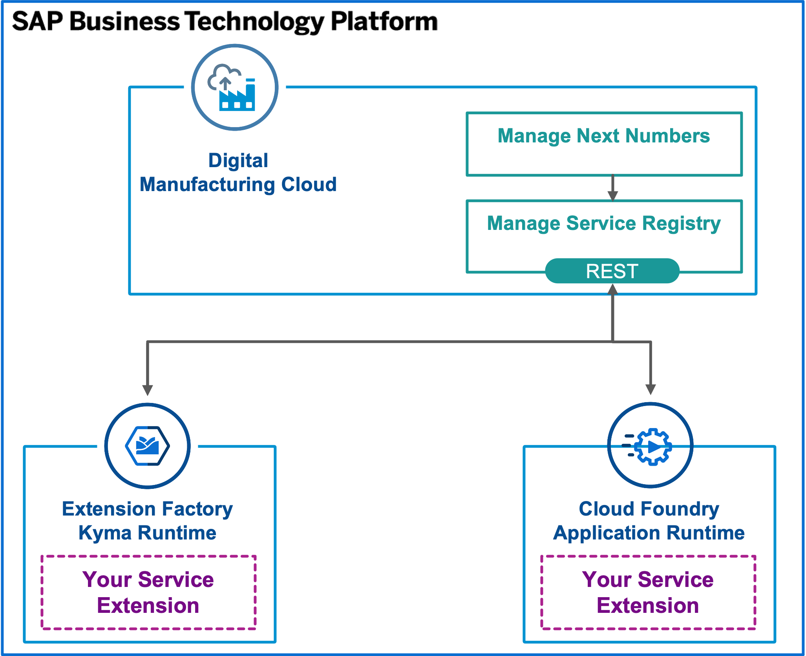

# Unit 3 - In-App Extensions

## Overview
###In-App Extensions
The ability to extend a core SAP DMC application by the available extension points (e.g. extend existing API, trigger a parallel processes, augment API outputs,etc). This spectrum of this extensibility use can go from simple to complex if the logic of the extension needs to call API’s from DMC. 

## Learning objectives
- Understand how to build custom business logic that can be embbed to standard SAP DMC Applications such as "Manage Next Number".

## BTP Components
- You can build your own extension either using Kyma or Cloud Foundry runtime of BTP.

## Implementation
- "Manage Next Number" app allows you to define numbering patterns of the types SFC Release, SFC Serialize, Incident Number, Batch Number, Inventory Receipt, Packing Unit Number, Tool Number and Process Lot Number.
- The custom API defined in Service Registry  can be linked to the field "Extension" which can be used to modify the next number behavior. 
- Replaceable parameters are variables that you can use in the system.  For more details, please refer to ["Replaceable Parameters for Use in Manage Next Numbers" in SAP Help document](https://help.sap.com/viewer/97c9e9b9fac74be2a023638cd1700b46/latest/en-US/3d61498ec33e44438ae9f32eb8b77e12.html).
- In our example, the extension is implemented in the Kyma Runtime of BTP.
- The below diagram shows the implementation architecture.

